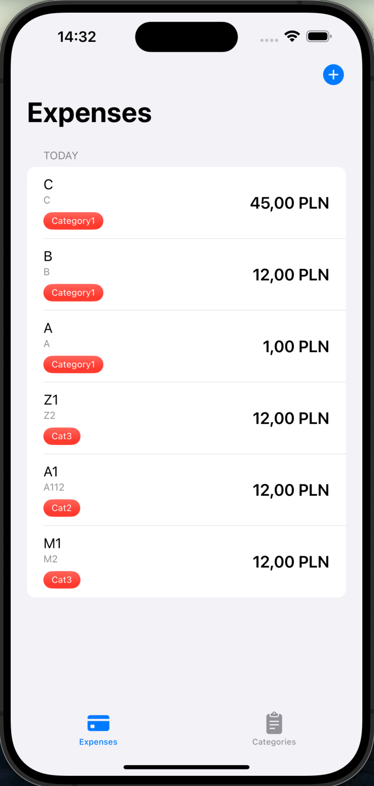
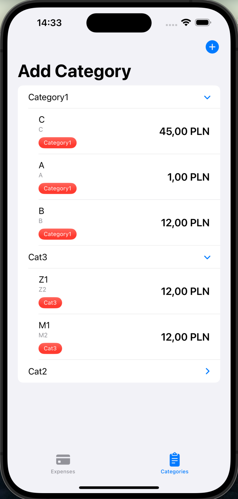

# Expense tracker

Tworzymy nowy projekt ExpenseTrackerX , zakladamy grupy Model, View. W grupupie Model dodajemy klase Expense. W niej importujemy SwiftUi i SwiftData. Klase ozdabiamy atrybutem @Model. W niej definiujemy pola title i subtile typu string. amount double i datę typu Date.

```swift
import Foundation
import SwiftData

@Model
class Expense {
    var title: String
    var subtitle: String
    var amount: Double
    var data: Date

    var category: Category?

    init(title: String, subtitle: String, amount: Double, data: Date, category: Category? = nil) {
        self.title = title
        self.subtitle = subtitle
        self.amount = amount
        self.data = data
        self.category = category
    }
}
```


Tworzymy klase category:

```swift
import Foundation
import SwiftData

@Model
class Category {
    var categoryName: String
    @Relationship(deleteRule: .cascade, inverse: \Expense.category)
    var expenses: [Expense]?

    init(categoryName: String) {
        self.categoryName = categoryName
    }
}
```


Przechodzimy do ExpenseTrackerXApp gdzie dodajemy kontener SwiftData:

```swift
import SwiftUI
import SwiftData

@main
struct ExpenseTrackerXApp: App {
    var body: some Scene {
        WindowGroup {
            ContentView()
        }
        .modelContainer(for: [Expense.self,Category.self])
    }
}
```

W grupie Views dodajemy 2 widoki : ExpensesView i CategoriesView. Przechodzimy do ContentView i definiujemy tam TabView z 2 ma zakładkami na wydatki i kategorie:


```swift
struct ContentView: View {
    @State private var currentTab: String = "Expenses"
    var body: some View {
        TabView (selection: $currentTab){
            ExpensesView()
                .tag("Expenses")
                .tabItem {
                    Image(systemName:"creditcard.fill")
                    Text("Expenses")
                }
            CategoriesView()
                .tag("Categories")
                .tabItem {
                    Image(systemName:"list.clipboard.fill")
                    Text("Categories")
                }

        }
    }
}
```

Przechodzimy do ExpesesView gdzie definiujemy NavigationStack a w nim Listę wydatkow :

```swift
        NavigationStack {
            List {

            }
            .navigationTitle("Expenses")
```

Następnie dodajemy toolbar z przyciskiem do dodawania Kategorii 

```swift
            .toolbar {
                ToolbarItem(placement: .topBarTrailing) {
                    Button {

                    } label: {
                        Image(systemName: "plus.circle.fill")
                            .font(.title3)
                    }
                }
            }
```


Z Tego względu, ze chcemy wydatki wyswietlac grupowane wg dni : dzisiaj, wczoraj w ub tygodniu, musismy zdefiniowac mode do przechowywania danych pogrupowanych dla potzreb widoku.

Definiujemy dodatkową klasę0 

```swift
struct GroupedExpense: Identifiable {
    var id:UUID = .init()
    var date: Date
    var expenses: [Expense]
}
```


W ExpensesView dodajemy kolekcje na dane:


```swift
struct ExpensesView: View {

    @Query(sort: [
        SortDescriptor(\Expense.date, order: .reverse)
    ],animation:.snappy) private var allExpenses: [Expense]

    @State private var groupedExpenses: [GroupedExpenses]
  ...
}
```


pod NavigationTitle dodajemy wyswietlanie informacji w przypadku braku wpisów:

```swift
            .overlay {
                if allExpenses.isEmpty || groupedExpenses.isEmpty {
                    ContentUnavailableView("No Expenses", systemImage: "tray.fill")
                }
            }
```

Na podgladzie uzyskamy mniej wiecej taki efekt:


Na onChanged dokladamy kod grupujacy wydatki, potrzebujemy funkcje ktora przygotuje nam kolekcje pogrupowanych danych:

```swift
func createGroupedExpenses(_ expenses: [Expense]) {
  Task.detached (priority: .high) {
    let groupedDict = Dictionary(grouping: expenses) { expense in
                                                      let dateComponents = Calendar.current.dateComponents([.day,.month,.year], from: expense.date)
                                                      return dateComponents
                                                     }
    ///Sorting dictionary in descending order
    let sortedDict = groupedDict.sorted {
      let calendar = Calendar.current
      let date1 = calendar.date(from: $0.key) ?? .init()
      let date2 = calendar.date(from: $1.key) ?? .init()

      return calendar.compare(date1, to: date2, toGranularity: .day) == .orderedDescending
    }

    /// Adding to grouped array
    /// UI must be updated on Main Thread
    ///
    await MainActor.run {
      groupedExpenses = sortedDict.compactMap({ dict in
         let date = Calendar.current.date(from: dict.key) ?? .init()
         return .init(date: date, expenses: dict.value)
                                              })
    }
  }
}
```

i możemy jej użyć 

```swift
var body: some View {
  NavigationStack {...}
  .onChange(of: allExpenses,initial: true) { oldValue, newValue in
      if groupedExpenses.isEmpty {
          createGroupedExpenses(newValue)
                                 }
  }
}
```


## AddExpenseView

Utworzymy teraz widok `AddExpenseView`, pozwalajacy wpisywac wydatki:

Standardowo dodajemy context i dismiss

```swift
import SwiftUI
import SwiftData

struct AddExpenseView: View {
    @Environment(\.dismiss) private var dismiss
    @Environment(\.modelContext) private var context


    var body: some View {
        Text("jakis smutny napis")
    }
}
```


nastepnie deklarujemy zmienne na dane do edycji:

```swift
    @State private var title: String = ""
    @State private var subtitle: String = ""
    @State private var date: Date = .init()
    @State private var amount: CGFloat = 0
    @State private var category: Category?
```


Definiujemy szkielet naszego widoku: NavigationStack w nim Lista z toolbarem z przycskami zapisz i anuluj:

```swift
var body: some View {
  NavigationStack {
    List {

    }
    .navigationTitle("Add Expense")
    j.navigationBarTitleDisplayMode(.inline)
    .toolbar {
      ToolbarItem (placement: .topBarLeading) {
        Button("Cancel") {
          dismiss()
        }
        .tint(.red)
      }
      ToolbarItem (placement: .topBarTrailing) {
        Button("Add", action: addExpense)

      }

    }
  }
}

func addExpense() {

}
```


Do zmienncyh dodajemy Query pobierajace kategorie :

```swift
 @Query(animation: .snappy) private var allCategories: [Category]
```

definiujemy formater dla kwot :

```swift
var formatter: NumberFormatter {
  let  formatter = NumberFormatter()
  formatter.numberStyle = .decimal
  formatter.maximumFractionDigits = 2
  return formatter
}
```

Wewnatrz listy dodajemy pola do wprowadzania danych:

```swift
List {
  Section("Title"){
    TextField("Magic keyboard", text: $title)
  }

  Section("Description"){
    TextField("Bought keyboard at the Apple Store", text: $subtitle)
  }

  Section("Amount Spent"){
    HStack(spacing: 4){
      Text("$")
      .fontWeight(.semibold)
      TextField("0.0",value: $amount,formatter: formatter)
    }
  }

  Section("Date"){
    DatePicker("",selection: $date, displayedComponents: [.date])
    .datePickerStyle(.graphical)
    .labelsHidden()
  }

  if !allCategories.isEmpty {
    HStack {
      Text("Category")
      Spacer()
      Picker("",selection: $category){
        ForEach(allCategories) {
          Text($0.categoryName)
          .tag($0)
        }

      }
      .pickerStyle(.menu)
      .labelsHidden()
    }
  }
}
```


Nie chcemy podwalać na zapisywanie danych gdy nie mamy opisanego zakupu i podanej kwoty:

Tworzymy funkcje do weryfikacji 

```swift
var formHasNotValidData: Bool {
  return title.isEmpty || subtitle.isEmpty || amount == .zero
}
```


i na jej podstawie aktywujemy lub wyłączamy przycisk `zapisz` :

```swift
ToolbarItem (placement: .topBarTrailing) {
  Button("Add", action: addExpense)
  .disabled(formHasNotValidData)

}
```

i na koniec funkcja zapisujaca nasze dane do bazy :

```swift
    func addExpense() {
        let expense = Expense(title: title, subtitle: subtitle, amount: amount, date: date, category: category)
        context.insert(expense)
        dismiss()
    }
```


Wracamy do Listy wydatków, dodamy teraz wywolanie widoku dopisywania wydatków. Tworzymy zmeinna zarządzająca pokazywanie arkusza z widokiem AddExpense:

```swift
@State private var addExpense: Bool = false
```

W przypadku nacisniecia przycisku dodaj ustawiamy ja na true:

```swift
                ToolbarItem(placement: .topBarTrailing) {
                    Button {
                        addExpense.toggle()
                    } label: {
                        Image(systemName: "plus.circle.fill")
                            .font(.title3)
                    }
                }
```

, co spoowduje pokazanie arkusza widoku:

```swift
        .sheet(isPresented: $addExpense){
            AddExpenseView()
        }
```


aby wyswietlac je pogrupowane potrzebujemy liste podzielić na sekcje

```swift
            List {
                ForEach(groupedExpenses) { group in
                    Section(group.groupTitle) {
                        ForEach(group.expenses) { expense in
                    ///CardView
                        }
                    }
                }
            }
```


Tworzymy widok pomocniczy do wyswietlenia pojedynczego wydatku :

```swift
struct ExpenseCardView: View {
    @Bindable var expense: Expense
    var body: some View {
        HStack {
            VStack(alignment: .leading){
                Text(expense.title)
                Text(expense.subtitle)
                    .font(.caption)
                    .foregroundStyle(.gray)
            }
            .lineLimit(1)
            Spacer(minLength: 5)
            Text(expense.currencyString).font(.title3.bold())
        }
    }
}
```

potrzebujemy rozbudować klase expense o currencyString:

```swift
    //Curency string
    var currencyString: String {
        let formatter = NumberFormatter()
        formatter.numberStyle = .currency
        return formatter.string( for: amount) ?? ""
    }
```

uruchamiamy aplikacje. mozna juz dodawac wydatki i widac je na liście.

Niestety widzimy ze lista nie zawsze sie odświeża - grupowanie nie jest wywoływane przy zmianie, wiec potrzebujemy zmodyfikowac warunek wyliczania grupy wydatkow :

```swift
        .onChange(of: allExpenses,initial: true) { oldValue, newValue in
            if newValue.count > oldValue.count || groupedExpenses.isEmpty {
                createGroupedExpenses(newValue)
            }
        }
```


Dodamy teraz usuwanie danych z listy. Przy ExpenseCardView dodajemy `swipeActions`

```swift
ExpenseCardView(expense: expense)
.swipeActions(edge: .trailing, allowsFullSwipe: false) {
  //Delete button
  Button {
    /// deleting data
    context.delete(expense)
  } label: {
    Image(system: "trash")
  }
  .tint(.red)
}
```

Musimy dodac do widoku kontekst modelu

```swift
@Environment(\.modelContext) private var context
```


dodatkowo ręcznie musimy obsłużyć sytuacje, ze jak z grupy usniemy wszystkie wydatki, to usuwamy także grupę:

```swift
Button {
  /// deleting data
  context.delete(expense)
  withAnimation {
    group.expenses.removeAll(where: {$0.id == expense.id})
    if group.expenses.isEmpty {
      GroupedExpenses.removeAll(where: {$0.id == group.id})
    }
  }
} label: {
  Image(system: "trash")
}
```


### CategoriesView

Przechodzimy do categories View i zaczynamy od szkieletu naszej listy:

```swift
import SwiftUI
import SwiftData

struct CategoriesView: View {
    var body: some View {
      NavigationStack {
        List {
        }
        .navigationTitle("Categories")
        .toolbar {
          ToolbarItem (placement: .topBarTrailing) {
            Button{
                newCategory.toggle()
            } label: {
                Image(systemName: "plus.circle.fill")
                    .font(.title3)
            }
          }
        }
      }
    }
}
```

dodajemy Query do pobrania danych :

```swift
    @Query(sort: [
        SortDescriptor(\Category.categoryName, order: .reverse)
    ],animation:.snappy) private var allCategories: [Category]
```

Dodajemy overlay do wyswietlenia pustej strony gdy nie mamy zadnych kategorii:

```swift
.overlay {
  if allCategories.isEmpty  {
    ContentUnavailableView("No Categories", systemImage: "tray.fill")
  }
}
```

Wywołanie arkusza do dopisywania nowych kategorii:

1. Zmienna lokalna do sterowania wyswietlaniem arkusza:

   ```swift
   @State private var newCategory: Bool = false
   
   //użyjemy jej przy przycisku 
   
   Button{
     newCategory.toggle()
   } label: {
   ```

   

2. Definicja  kontekstu magazynu danych:

   ```swift
   @Environment(\.modelContext) private var context
   ```

3. Zmienna do wpisywania nazwy kategorii:

   ```swift
   @State private var categoryName: String = ""
   ```

4. Wywołanie arkusza do wprowadzania kategorii:

   ```swift
   .sheet(isPresented: $newCategory) {
   
   } content: {
     NavigationStack {
       List {
         Section("Title") {
           TextField("General",text: $categoryName)
         }
       }
       .navigationTitle("CategoryName")
       .navigationBarTitleDisplayMode(.inline)
       /// Ad and Cancel buttons
       .toolbar {
         ToolbarItem(placement: .topBarLeading) {
           Button("Cancel") {
             newCategory = false
           }
           .tint(.red)
         }
         ToolbarItem(placement: .topBarTrailing) {
           Button("Add") {
   
           }
           .disabled(categoryName.isEmpty)
   
         }
       }
     }
   }
   .presentationDetents([.height(180)])
   .presentationCornerRadius(20)
   .interactiveDismissDisabled()
   ```

5. Kod zapisujacy dane na przycisku Add:

   ```swift
   ToolbarItem(placement: .topBarTrailing) {
     Button("Add") {
       let category = Category(categoryName: categoryName)
       context.insert(category)
       //ClosingView
       categoryName = ""
       newCategory = false
     }
     .disabled(categoryName.isEmpty)
   }
   ```

   

6. W liscie iterujemy po kategoriach gdzie wyświetlamy kategorie i wydatki z niej, a jeśli nie ma wydatków to ContentUnavaiableView:

```swift
        List {
            ForEach (allCategories) { category in
                DisclosureGroup {
                    if let expenses = category.expenses, !expenses.isEmpty {
                        ForEach(expenses){ expense in
                            ExpenseCardView(expense: expense)
                        }
                    } else {
                        ContentUnavailableView{
                            Label("No Expenses", systemImage: "tray.fill")
                        }
                    }
                } label: {
                    Text(category.categoryName)
                }
            }
        }
```

Kompiluejmy aplikacje dodajemy kilka kategorii i potem kilka kosztow

Niestety nasz picker kategorii nie pozwala na wybranie opcji - brak (None). Wiec jeśli jest potrzeba wpisywania kosztow nieskategoryzowanych, trzeba za pomoca menu zrobic jego odpowiednik:

```swift
Menu {
  ForEach(allCategories) { category in
                          Button(category.categoryName) {
                            self.category = category
                          }
                         }
  //None button
  Button("None") {
    category = nil
  }
} label: {
  if let categoryName = category?.categoryName {
    Text(categoryName)
  } else {
    Text("None")
  }
}
//                        Picker("",selection: $category){
//                            ForEach(allCategories) {
//                                Text($0.categoryName)
//                                    .tag($0)
//                            }
//
//                        }
//                        .pickerStyle(.menu)
//                        .labelsHidden()
```


Możemy dodatkowo posortować nasze kategorie wg liczby wydatkow w każdej z nich:

```swift
    var body: some View {
      NavigationStack {
        List {
            ForEach (allCategories.sorted(by: {
                ($0.expenses?.count ?? 0) > ($1.expenses?.count ?? 0)
            })) { ...}
          ....
```


Na karcie wydatku chcemy wyswietlac jego kategorie, ale tylko na widoku z listy wydatków, bo jesli wyswietlamy z listy kategorii to dodatkowa kategoria jest tylko nadmiarowa.

Wyświetlanie lub nie, uzależnimy od parametru dla widoku `ExpensecardView` :

```swift
    var displayTag: Bool = true
```

i jesli mamy wybrana kategorie i chcemy pokazywac ją :

```swift
struct ExpenseCardView: View {
    @Bindable var expense: Expense
    var displayTag: Bool = true
    var body: some View {
        HStack {
            VStack(alignment: .leading){
                Text(expense.title)
                Text(expense.subTitle)
                    .font(.caption)
                    .foregroundStyle(.gray)

                if let categoryName = expense.category?.categoryName, displayTag {
                    Text(categoryName)
                        .font(.caption2)
                        .foregroundStyle(.white)
                        .padding(.horizontal,10)
                        .padding(.vertical,4)
                        .background(.red.gradient,in: .capsule)
                }
            }
            .lineLimit(1)
```

Co na widoku wydatkow daje taki efekt:

 


Ale na widoku kategorii już go nie chcemy:



Wyłączymy to za pomoca flagi display tag w widoku CategriesView:

```swift
                DisclosureGroup {
                    if let expenses = category.expenses, !expenses.isEmpty {
                        ForEach(expenses){ expense in
                            ExpenseCardView(expense: expense,displayTag: false)
                        }
                    } else {
                        ContentUnavailableView{
                            Label("No Expenses", systemImage: "tray.fill")
                        }
                    }
                }
```


Dodamy teraz możliwość usunięcia kategorii. Pod DisclosureGroup dodajemy modyfikator .swpeActions z przyciskiem do usuwania:


```swift
                .swipeActions(edge: .trailing, allowsFullSwipe: false) {
                    Button {
                        deleteRequest.toggle()
                        requestedCategory = category
                    } label: {
                        Image(systemName: "trash")
                    }
                }
```

do obslugi potrezbujemy 2ch zmiennych. Piersza z nich zainicjuje proces usuwania z pytaniem uzytkownika czy jest pewny tej akcji, a druga przekaze jaka kategoria ma byc skasowana:

```swift
    @State private var deleteRequest: Bool = false
    @State private var requestedCategory: Category?
```

Na podstawie pierwszej wyswietlimy alert w ktorym obsluzymy reszte procesu usuwania danych :

```swift
      .alert("If you delete a category, all associated expenses will be deleted too.",isPresented: $deleteRequest) {
          Button(role: .destructive) {
            /// Deleting category
              if let requestedCategory {
                  context.delete(requestedCategory)
                  self.requestedCategory = nil
              }
          } label: {
              Text("Delete")
          }

          Button(role: .cancel) {
              requestedCategory = nil
          } label: {
              Text("Cancel")
          }
      }
```

