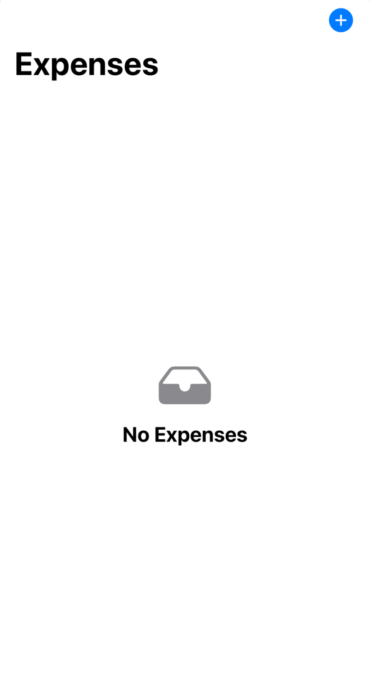

# Expense tracker

Tworzymy nowy projekt ExpenseTrackerX , zakladamy grupy Model, View. W grupupie Model dodajemy klase Expense. W niej importujemy SwiftUi i SwiftData. Klase ozdabiamy atrybutem @Model. W niej definiujemy pola title i subtile typu string. amount double i datę typu Date.

```swift
import Foundation
import SwiftData

@Model
class Expense {
    var title: String
    var subtitle: String
    var amount: Double
    var data: Date

    var category: Category?

    init(title: String, subtitle: String, amount: Double, data: Date, category: Category? = nil) {
        self.title = title
        self.subtitle = subtitle
        self.amount = amount
        self.data = data
        self.category = category
    }
}
```


Tworzymy klase category:

```swift
import Foundation
import SwiftData

@Model
class Category {
    var categoryName: String
    @Relationship(deleteRule: .cascade, inverse: \Expense.category)
    var expenses: [Expense]?

    init(categoryName: String) {
        self.categoryName = categoryName
    }
}
```


Przechodzimy do ExpenseTrackerXApp gdzie dodajemy kontener SwiftData:

```swift
import SwiftUI
import SwiftData

@main
struct ExpenseTrackerXApp: App {
    var body: some Scene {
        WindowGroup {
            ContentView()
        }
        .modelContainer(for: [Expense.self,Category.self])
    }
}
```

W grupie Views dodajemy 2 widoki : ExpensesView i CategoriesView. Przechodzimy do ContentView i definiujemy tam TabView z 2 ma zakładkami na wydatki i kategorie:


```swift
struct ContentView: View {
    @State private var currentTab: String = "Expenses"
    var body: some View {
        TabView (selection: $currentTab){
            ExpensesView()
                .tag("Expenses")
                .tabItem {
                    Image(systemName:"creditcard.fill")
                    Text("Expenses")
                }
            CategoriesView()
                .tag("Categories")
                .tabItem {
                    Image(systemName:"list.clipboard.fill")
                    Text("Categories")
                }

        }
    }
}
```

Przechodzimy do ExpesesView gdzie definiujemy NavigationStack a w nim Listę wydatkow :

```swift
        NavigationStack {
            List {

            }
            .navigationTitle("Expenses")
```

Następnie dodajemy toolbar z przyciskiem do dodawania Kategorii 

```swift
            .toolbar {
                ToolbarItem(placement: .topBarTrailing) {
                    Button {

                    } label: {
                        Image(systemName: "plus.circle.fill")
                            .font(.title3)
                    }
                }
            }
```


Z Tego względu, ze chcemy wydatki wyswietlac grupowane wg dni : dzisiaj, wczoraj w ub tygodniu, musismy zdefiniowac mode do przechowywania danych pogrupowanych dla potzreb widoku.

Definiujemy dodatkową klasę0 

```swift
struct GroupedExpense: Identifiable {
    var id:UUID = .init()
    var date: Date
    var expenses: [Expense]
}
```


W ExpensesView dodajemy kolekcje na dane:


```swift
struct ExpensesView: View {

    @Query(sort: [
        SortDescriptor(\Expense.date, order: .reverse)
    ],animation:.snappy) private var allExpenses: [Expense]

    @State private var groupedExpenses: [GroupedExpenses]
  ...
}
```


pod NavigationTitle dodajemy wyswietlanie informacji w przypadku braku wpisów:

```swift
            .overlay {
                if allExpenses.isEmpty || groupedExpenses.isEmpty {
                    ContentUnavailableView("No Expenses", systemImage: "tray.fill")
                }
            }
```

Na podgladzie uzyskamy mniej wiecej taki efekt:




Na onChanged dokladamy kod grupujacy wydatki, potrzebujemy funkcje ktora przygotuje nam kolekcje pogrupowanych danych:

```swift
func createGroupedExpenses(_ expenses: [Expense]) {
  Task.detached (priority: .high) {
    let groupedDict = Dictionary(grouping: expenses) { expense in
                                                      let dateComponents = Calendar.current.dateComponents([.day,.month,.year], from: expense.date)
                                                      return dateComponents
                                                     }
    ///Sorting dictionary in descending order
    let sortedDict = groupedDict.sorted {
      let calendar = Calendar.current
      let date1 = calendar.date(from: $0.key) ?? .init()
      let date2 = calendar.date(from: $1.key) ?? .init()

      return calendar.compare(date1, to: date2, toGranularity: .day) == .orderedDescending
    }

    /// Adding to grouped array
    /// UI must be updated on Main Thread
    ///
    await MainActor.run {
      groupedExpenses = sortedDict.compactMap({ dict in
         let date = Calendar.current.date(from: dict.key) ?? .init()
         return .init(date: date, expenses: dict.value)
                                              })
    }
  }
}
```

i mozemy jej użyć 

```swift
var body: some View {
  NavigationStack {...}
  .onChange(of: allExpenses,initial: true) { oldValue, newValue in
      if groupedExpenses.isEmpty {
          createGroupedExpenses(newValue)
                                 }
  }
}
```


## AddExpenseView

Utworzymy teraqz ekran pozwalajacy wpisywac wydatki:

